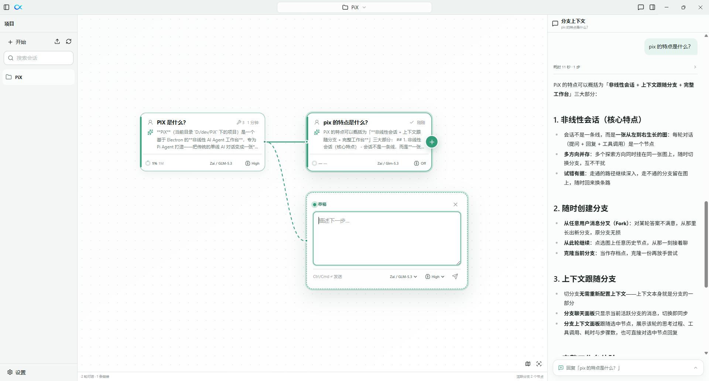

<p align="center">
  
</p>

<h1 align="center">PiX</h1>

<p align="center">非线性的 AI Agent 工作台 —— 会话是一张图，随时分叉，上下文跟随分支</p>

<p align="center"><a href="README.en.md">English</a> · 中文</p>

---

<p align="center">
  
</p>

PiX 的会话不是一条线，而是一张会生长的图：每一轮对话都是图上的一个节点，任何一个节点都可以随时长出新分支。

## 非线性会话

传统的 AI 对话是一条单线时间轴：想换一个方向，要么推倒重来，要么在原对话里继续追问、让上下文越来越混乱。

PiX 把会话组织成一张从左到右生长的图：

- 每一轮对话（你的提问 + 助手的回复与工具调用）是图上的一个节点。
- 多个探索方向可以并存于同一张图上，随时切换分支继续推进，互不干扰。
- 哪条路径走通了就继续深入，走不通的分支留在图上，随时可以回来换条路再试。
- 会话就是真实的 Pi 会话，不发明新格式，离开 PiX 也能继续使用。

## 随时创建分支

分支是 PiX 的日常动作，而不是需要预先规划的操作：

- **从任意一条用户消息分叉**（Fork）：对某一轮的答案不满意，直接从那里分出一条新分支换个问法或换个方案，原分支完好无损。
- **从此轮继续**：在图上点选任意历史节点，从那一刻接着聊。
- **克隆当前分支**：想做存档点时，克隆一份当前分支再放手尝试。每一个分支都在图中留存显示，随时切换。

## 上下文跟随分支

切分支的时候，你不需要"重新配置上下文"——上下文本来就是分支的一部分：

- **分支聊天面板**只显示当前活跃分支上的消息。切到另一个分支，聊天记录立刻跟着切换。
- 在图上点选任意节点，活跃分支随之切换，聊天面板、分支上下文面板都会对齐到那个节点。
- **分支上下文面板**跟随选中的节点，展示该轮的工作过程：思考过程、工具调用、耗时与步骤数，也可以直接在这里对选中节点发起回复。

## 工作台

```text
导航器 | 会话图 | 分支聊天 | 内容工作区
      |---------- 可伸缩工具坞 ----------|
```

- **导航器**：列出真实的 Pi 会话，支持搜索、重命名、导入。
- **会话图**：主面板，从左到右展示整张会话图，活跃分支高亮，附小地图。
- **分支聊天**：只显示当前活跃分支的对话。
- **内容工作区**：打开项目文件、查看 Git 更改、浏览网页。
- 各面板均可折叠、恢复、调整大小；通过 SSH 或 WSL 连接远程 Linux 工作区时，体验与本地一致。

## 远程 Node 环境

SSH 和 WSL 共用安装流程：保留正常的已选 Node；首次安装优先使用 PATH 或交互登录环境（如 nvm）中的 Linux Node，最低版本为 22.19.0。安装依赖、启动服务、WebSocket 连接和真实终端检查全部通过后，才切换当前安装。

找不到兼容环境时，才使用 PiX 固定版本的私有 Node；不再跟随桌面端 Node 的补丁版本重复下载。启动使用固定的可执行文件路径，Node 版本变化会重新检查；重新连接时可修复缺失或不兼容的环境。不会修改系统 Node，也不会自动删除旧安装或共享运行时。

开发测试：`node --test scripts/remote-runtime.test.mjs`（Windows 默认使用 Ubuntu-24.04，可设置 `PIX_TEST_WSL_DISTRO`）。构建服务端后，`node scripts/runtime-live-test.mjs --ssh HOST` 或 `--wsl DISTRO` 在独立临时目录验证真实 Node 复用，不切换正式安装。

## 自定义模型

Graph node 和 chat panel 的输入框均支持选择、粘贴或拖入图片，并可预览、移除和只发送图片。需选择支持图片的模型；支持 PNG、JPEG、WebP、GIF，每次最多 8 张，单张 5 MB、合计 10 MB。图片随 Pi 会话保存，可在聊天记录和节点预览中查看。

打开 **设置 → 模型 → 添加自定义模型**，填写服务商 ID、API 地址和模型 ID，选择 OpenAI Chat Completions / Responses、Anthropic Messages 或 Google Generative AI 协议。可配置上下文长度、最大输出、推理和图片输入能力。Ollama 等本地服务可勾选“此接口无需 API 密钥”。

模型使用 [Pi SDK 的 models.json 格式](https://github.com/earendil-works/pi/blob/main/packages/coding-agent/docs/models.md)，保存在 `~/.pi/agent/models.json`，密钥通过 Pi 保存到本机 `auth.json`。保存后立即刷新模型列表；未提供密钥的服务商可随后配置凭据。WSL/SSH 会话通过本机代理调用这些模型，无需复制密钥。高级兼容配置可编辑 `models.json` 后点击刷新。

## 下载

PiX 内置 `@injaneity/pi-computer-use`、`@ff-labs/pi-fff` 和 `pi-web-access`，均通过 Pi 扩展机制加载。扩展及其运行依赖会随安装包一起分发，无需另行安装；如果已通过 Pi 安装同名 npm 包，则优先使用你安装的版本。网页搜索服务仍使用用户自己的配置与凭据。

从 [GitHub Releases](https://github.com/huang-sh/PiX/releases) 下载对应平台的安装包：

- **Windows**：`PiX-Setup-x.y.z.exe`（安装版）或 `PiX-Portable-x.y.z.exe`（免安装便携版），x64。
- **macOS**：`PiX-x.y.z-arm64.dmg` 或 `PiX-x.y.z-x64.dmg`，另提供 zip 包。

安装包未签名：Windows SmartScreen 提示时选择"仍要运行"；macOS 首次打开需在 系统设置 → 隐私与安全性 中允许。

<details>
<summary>从源码运行</summary>

需要 Node.js 22.19 或更高版本。

```bash
npm install
npm run dev
```

`npm run verify` 可执行完整的类型检查、测试与启动冒烟验证。

`npm run test:fff` 验证内置文件搜索；`npm run test:web` 验证网页扩展依赖打包与网页抓取，均使用独立测试配置。macOS 使用 `npm run dist:mac` 打包当前机器架构；CI 分别在 Apple Silicon 和 Intel runner 上构建对应安装包，以包含正确的本机运行库。

</details>
