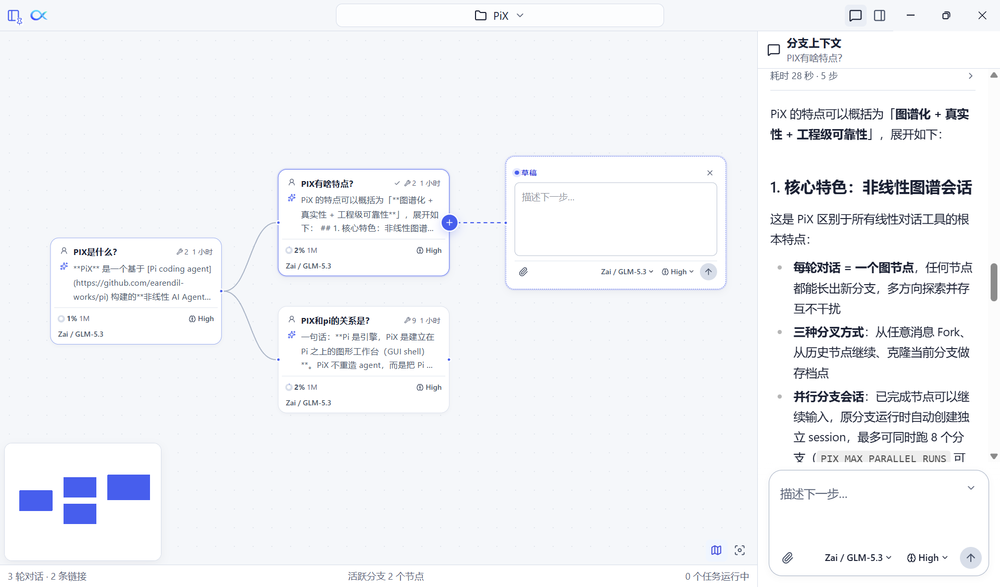
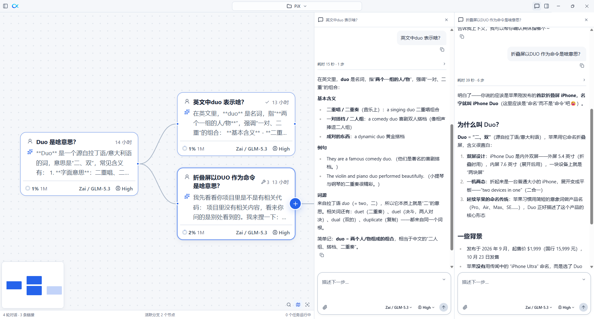

<p align="center">
  
</p>

<h1 align="center">PiX</h1>

<p align="center">非线性的 AI Agent 工作台 —— 会话是一张图，随时分叉，上下文跟随分支</p>

<p align="center"><a href="README.md">English</a> · 中文</p>

---

<p align="center">
  
</p>

PiX 的会话不是一条线，而是一张会生长的图：每一轮对话都是图上的一个节点，任何一个节点都可以随时长出新分支。

## 非线性会话

传统的 AI 对话是一条单线时间轴：想换一个方向，要么推倒重来，要么在原对话里继续追问、让上下文越来越混乱。

PiX 把会话组织成一张从左到右生长的图：

- 每一轮对话（你的提问 + 助手的回复与工具调用）是图上的一个节点。
- 多个探索方向可以并存于同一张图上，随时切换分支继续推进，互不干扰。
- 哪条路径走通了就继续深入，走不通的分支留在图上，随时可以回来换条路再试。
- 会话就是真实的 Pi 会话，不发明新格式，离开 PiX 也能继续使用。

## 随时创建分支

分支是 PiX 的日常动作，而不是需要预先规划的操作：

- **从任意一条用户消息分叉**（Fork）：对某一轮的答案不满意，直接从那里分出一条新分支换个问法或换个方案，原分支完好无损。
- **从此轮继续**：在图上点选任意历史节点，从那一刻接着聊。
- **克隆当前分支**：想做存档点时，克隆一份当前分支再放手尝试。每一个分支都在图中留存显示，随时切换。

## 上下文跟随分支

切分支的时候，你不需要"重新配置上下文"——上下文本来就是分支的一部分：

- **分支聊天面板**只显示当前活跃分支上的消息。切到另一个分支，聊天记录立刻跟着切换。
- 单击节点只在图上高亮选中，不改变任何面板内容（图上的命令，如 /fork，作用于高亮的节点）；双击节点，主聊天面板对齐到那个节点。
- 双击图上的节点，在主面板打开该节点的对话；Ctrl+双击（或右键菜单"在聊天面板中打开"）则把该分支固定到并排的第二、三个聊天列，最多同时显示 3 列，方便对比不同分支。同一条分支只保留一个面板，后打开的节点会替换该分支已有的面板。每列都能独立滚动、独立回复。在固定列里发送回复，该列会跟随新节点继续显示这条分支的对话，主面板不受影响；关闭全部固定列（或下次启动）后，聊天区宽度自动还原。
- **分支上下文面板**跟随选中的节点，展示该轮的工作过程：思考过程、工具调用、耗时与步骤数，也可以直接在这里对选中节点发起回复。

<p align="center">
  
</p>

## 内置扩展

PiX 内置两个扩展，均通过 Pi 扩展机制加载；两者含原生二进制，扩展及运行依赖随安装包分发，无需另行安装（如果已通过 Pi 安装同名 npm 包，则优先使用你安装的版本）。

- **`@ff-labs/pi-fff` — 高速文件与内容搜索**：用 FFF（Rust 原生、SIMD 加速）替换内置的 `find` / `grep` 工具：`fffind` 模糊文件名搜索、`ffgrep` 内容搜索、`fff-multi-grep` 多模式搜索。会话开始时后台预索引，搜索即时返回；按 frecency 排序（常用文件靠前），git 修改与未跟踪文件加权。
- **`@injaneity/pi-computer-use` — 桌面应用操控**：让智能体观察并操控 macOS、Windows、Linux 上的桌面应用：查找打开的应用与窗口、读取界面上的文本与控件、点击、输入、滚动、等待界面变化。适用于应用没有 API、只有图形界面的场景（macOS 助手要求 macOS 14 或更高版本）。

`pi-web-access` 不随安装包分发：在设置 → 扩展页可一键安装到用户配置，之后通过 `pi update` 独立更新。它为智能体提供网页搜索、URL 抓取、PDF 抽取与 GitHub 研究能力；网页搜索服务仍使用你自己的配置与凭据。

此外，PiX 自身还带一个内部的 `file-changes` 扩展（不可卸载）：在智能体编辑、写入文件前后拍快照，为"变更"面板提供数据。

## 下载

从 [GitHub Releases](https://github.com/huang-sh/PiX/releases) 下载对应平台的安装包：

- **Windows**：`PiX-Setup-x.y.z.exe`（安装版）或 `PiX-Portable-x.y.z.exe`（免安装便携版），x64。
- **macOS**：`PiX-x.y.z-arm64.dmg` 或 `PiX-x.y.z-x64.dmg`，另提供 zip 包。
- **Linux**：`PiX-x.y.z-x86_64.AppImage`（免安装）、`PiX-x.y.z-amd64.deb`、`PiX-x.y.z-x86_64.rpm`，另提供 tar.gz，x64。

安装包未签名：Windows SmartScreen 提示时选择"仍要运行"；macOS 首次打开需在 系统设置 → 隐私与安全性 中允许。

<details>
<summary>从源码运行</summary>

需要 Node.js 22.19 或更高版本。

```bash
npm install
npm run dev
```

`npm run verify` 可执行完整的类型检查、测试与启动冒烟验证。

`npm run test:fff` 验证内置文件搜索；`npm run test:web` 通过真实 npm 安装验证网页扩展的安装布局与网页抓取（需要网络），均使用独立测试配置。macOS 使用 `npm run dist:mac` 打包当前机器架构；Linux 使用 `npm run dist:linux` 打包 AppImage、deb、rpm 和 tar.gz。CI 分别在 Apple Silicon、Intel 和 Ubuntu runner 上构建对应安装包，以包含正确的本机运行库。

</details>

## 交流群

扫码加入微信交流群：

<p>
  
</p>

## 贡献者

感谢所有为 PiX 做出贡献的人：

<!-- CONTRIBUTORS:START -->
<a href="https://github.com/huang-sh"></a>
<a href="https://github.com/mugpeng"></a>
<a href="https://github.com/github-actions[bot]"></a>
<a href="https://github.com/kindredzhang"></a>
<a href="https://github.com/xxnuo"></a>
<a href="https://github.com/jinjianghao"></a>
<!-- CONTRIBUTORS:END -->

欢迎参与：问题反馈和功能建议请开 [issue](https://github.com/huang-sh/PiX/issues)；修 bug 或加功能请提交 Pull Request。
